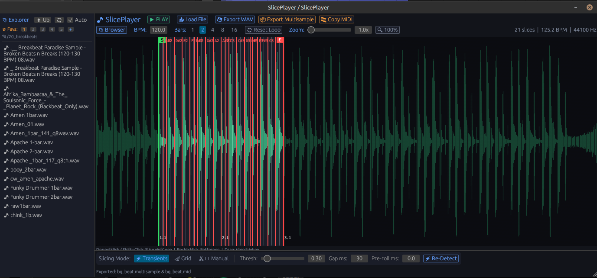

# SlicePlayer 🎹⚡



**SlicePlayer** is an open-source, high-performance **CLAP audio plugin** for Linux, macOS, and Windows designed for dynamic audio loop slicing, real-time playback, and direct export to **Bitwig Studio `.multisample` archives** with synchronized MIDI pattern clips.

Built with Rust, [`nih-plug`](https://github.com/robbert-vdh/nih-plug), [`egui`](https://github.com/emilk/egui), and C++ REX2/DWOP codec support via **VelociLoops**.

---

## 📖 Quick User Guide

### 1. Load Audio & Browse Loops 📁
- Click **`Browser`** to toggle the built-in file explorer sidebar.
- Browse your sample library and double-click any `.wav`, `.flac`, `.mp3`, or REX (`.rx2`, `.rex`, `.rcy`) loop file to load it instantly.

### 2. Choose Slicing Mode ⚡
- **`⚡ Transients`**: Uses SuperFlux spectral onset analysis to detect natural drum and instrument attacks.
  - **Threshold**: Adjust sensitivity (`0.05` – `1.00`).
  - **Gap ms**: Set minimum distance between slice markers to avoid micro-fragments.
  - **Re-Detect**: Re-calculate slice points instantly after tweaking settings.
- **`📐 Grid`**: Automatically divides the loop by musical time signature subdivisions (1/4, 1/8, 1/16, 1/32).
- **`✂️ Manual`**: 
  - **Double-click / Shift+Click** on the waveform to add a custom slice marker.
  - **Right-click** a slice marker to remove it.
  - **Drag** slice handles to adjust boundaries.

### 3. Set Loop Markers 🔁
- Drag the **`S` (Start)** and **`E` (End)** green/red boundary handles to isolate specific bar sections of your loop.
- Use the **Bars** buttons (`1`, `2`, `4`, `8`, `16`) to snap loop boundaries automatically.

### 4. Export to Bitwig Studio 📦
- Click **`📦 Export Multisample`** to select a save location.
- SlicePlayer exports two files simultaneously with matching stem filenames:
  1. `YourLoop.multisample`: Uncompressed Bitwig Sampler ZIP archive containing all slice WAVs mapped to contiguous keys (`C3`, `C#3`, `D3`...) with zero-pitch tracking (`track="0.0000"`).
  2. `YourLoop.mid`: Standard MIDI Type-0 clip matching the exact slice pattern.

### 5. Drag & Drop / Clipboard MIDI 🎹
- Click **`🎹 Copy MIDI`** or drag the button directly into your DAW timeline.
- In Bitwig Studio or REAPER, simply press **Ctrl+V** on any instrument track to paste the slice trigger pattern!

---

## ✨ Key Features

- **🎧 Onset & Grid Slicing**: SuperFlux spectral onset analysis + beat grid divisions + manual waveform editing.
- **🎛️ Global Master Audio FX Section**:
  - 📻 **Akai S950 Sampler**: 12-bit/10-bit DAC downsampling quantization (7.5k–19.2k Hz) with steep 6-pole Butterworth reconstruction filter.
  - 🎛️ **Elektron Digitakt Warm Overdrive**: Authentic 5-stage mathematical DSP model (quadratic gain scaling, asymmetric $\tanh$ soft-clipping with 2nd-harmonic DC bias, dynamic $G_{\text{out}}$ auto-gain compensation, 1st-order IIR DC blocker, and anti-aliasing reconstruction).
  - 🎚️ **Mackie CR-1604 Transistor Red-Line**: 90s console transistor overdrive with 1.5 kHz transformer mid-band punch resonance, cubic soft-knee transistor saturation, and dynamic level compensation.
  - 📼 **Analog Studio Tape Saturation**: Soft $\tanh$ tape saturation curve, 75 Hz low-end head bump, and HF softness compression.
- **🌴 Jungle & Drum & Bass Shuffler**: 1-click generative syncopation & snare roll generator with 4 algorithmic styles (Amen Roller, Syncopated Funk, Ghost Notes Only, Wild Chopper), gapless continuous beat protection, and beat locking.
- **📦 Bitwig Studio `.multisample` Export**: Streaming-ready uncompressed ZIP archive with native 1:1 Bitwig XML schema (`<key high="..." low="..." root="..." track="0.0000" tune="0.00"/>`).
- **🎹 Companion MIDI Pattern Export**: Automatic `.mid` clip export + system clipboard `text/uri-list` pasting.
- **⚡ Real-Time Audio Engine**: Zero-heap allocation audio rendering loop for real-time safety.
- **🎵 REX / REX2 Import**: Native decoding of Propellerhead REX2 (`.rx2`), REX (`.rex`), and RCY (`.rcy`) files via VelociLoops.

---

## 🚀 Installation & Multi-Platform Downloads

Pre-compiled **CLAP plugin binaries** for all major operating systems are published automatically on the [Releases Page](https://github.com/kiklabautermann/sliceplayer/releases):

- 🐧 **Linux x64**: `slice_player-linux-x64.clap` (or copy local [`bin/slice_player.clap`](bin/slice_player.clap) to `~/.clap/`)
- 🍎 **macOS Apple Silicon (M1/M2/M3/M4)**: `slice_player-macos-arm64.clap` (copy to `~/Library/Audio/Plug-Ins/CLAP/`)
- 🪟 **Windows x64**: `slice_player-windows-x64.clap` (copy to `%COMMONPROGRAMFILES%\CLAP\`)

---

## 🛠️ Building from Source

### Prerequisites
- Rust 1.75+ toolchain (`rustup`)
- C++17 compatible compiler (`g++`, `clang++`, or MSVC)
- `cmake`

### Build Commands

```bash
# Clone repository recursively
git clone --recursive https://github.com/kiklabautermann/sliceplayer.git
cd sliceplayer

# Build release bundle
cargo run --package xtask -- bundle --release
```

## 🗺️ Roadmap & Feature Requests

Check out our [ROADMAP.md](ROADMAP.md) for planned features, DSP enhancements, and export formats. Have an idea? Feel free to submit feature requests via [GitHub Issues](https://github.com/kiklabautermann/sliceplayer/issues)!

---

## 🙏 Credits & Acknowledgements

- **[VelociLoops](https://github.com/kunitoki/VelociLoops)** by [@kunitoki](https://github.com/kunitoki): Open-source C library for reading, writing, and transient-slicing REX2 (`.rx2`) audio containers and decoding the DWOP bitstream.
- **[nih-plug](https://github.com/robbert-vdh/nih-plug)** by [@robbert-vdh](https://github.com/robbert-vdh): Rust audio plugin framework for CLAP and VST3.

---

## 📄 License

Open-source software licensed under the MIT License. See [LICENSE](LICENSE) for details.

---

## ⚠️ Disclaimer & Liability

This software is provided **"AS IS"**, without warranty of any kind, express or implied. In no event shall the authors or copyright holders be liable for any claim, damages, data loss, project corruption, or other liability arising from the use or inability to use this software. Users are advised to back up important audio files and DAW projects prior to use.

